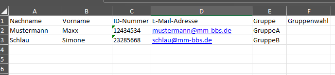

## Installation des Moduls CSHelper

Zum Installieren des Mdoult öffnen Sie eine Powershell Console und schreiben:

```ps
Install-Module -Name CSHelper
```

Ob die Module geladen wurden können Sie über folgenden Powershell Befehl abfragen:

```ps
Get-Command -Module CSHelper
```

## Anlegen und Löschen von Gruppen und Usern

Gruppen werden in CloudStack als Accounts angelegt und diesen Accounts dann die Gruppenmitglieder als User hinzugefügt.

Die Daten bildet eine Excel Tabelle die aus einer Moodle Gruppenwahl entstanden ist. Die Tabelle hat dabei folgendes Aussehen:



### Anlegen der Gruppen und User

Mit Hilfe des Skriptes *CreateAccounts.ps1* können die Gruppen und User angelegt werden.

Durch das Skript *DeleteAccounts.ps1*  werden die Accounts (Gruppen) wieder gelöscht.

Es müssen folgende Werte angegeben werden:

- APIKey: Der CloudStack API Key
- Secret: Das Cloud Stack Secret
- Pfad zur Excel Tabelle
- DomainID: Die Domain ID für die Gruppen

Diese Werte werden verschlüsselt in der Datei *secret.json* gespeichert, so dass bei einem neuen Start des Skriptes nur noch der Pfad zur Excel Tabelle und die DomainID angegeben werden müssen, bzw. diese schon mir korrekten Defaultwerten belegt sind, so dass nur noch RETURN gedrückt werden muss.